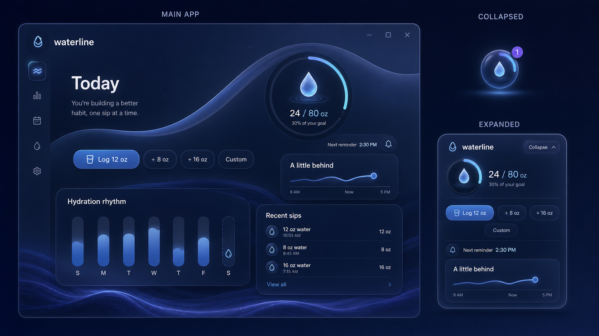

# Waterline for Windows

Waterline is a calm desktop hydration tracker designed to stay useful without becoming distracting. It combines a full daily dashboard, a transparent always-on-top widget, native Windows reminders, gentle sounds, and automatic updates.



## Features

- Track water with one-click 8 oz, 12 oz, and 16 oz buttons or enter a custom amount.
- See daily progress, remaining ounces, recent drinks, and a seven-day hydration rhythm.
- Keep an always-on-top widget available without covering your work.
- Collapse the widget into a small notification orb and expand it when you need to log a drink.
- Schedule native Windows reminders only on selected days and during selected work hours.
- Reset the reminder timer automatically whenever you log a drink.
- Enable or disable soft sounds for drink logging and reminders.
- Check for updates from Settings; new releases download in the background.
- Prevent duplicate instances—opening Waterline again focuses the existing app.
- Keep hydration history and settings locally on your computer.

## Download and install

Waterline currently supports Windows.

1. Open the [latest Waterline release](https://github.com/AayyKay/waterline/releases/latest).
2. Under **Assets**, download `Waterline-Setup-1.0.0.exe` (or the installer for the newest version).
3. Run the downloaded installer.
4. Choose the installation folder when prompted, then finish installation.
5. Launch **Waterline** from the Start menu or desktop shortcut.

### Windows SmartScreen notice

The installer is not yet code-signed, so Windows may display **Windows protected your PC**. If you trust this repository and downloaded the installer from its official Releases page, select **More info**, verify that the app name is Waterline, and choose **Run anyway**.

## Getting started

### 1. Set your daily goal

Open **Settings** from the left sidebar. Use the daily-goal controls to choose your target in ounces. The default is 80 oz.

### 2. Configure your schedule

In Settings, choose:

- The start and end of your workday.
- The days on which reminders are allowed.
- A reminder interval of 30, 45, 60, 90, or 120 minutes.

Waterline remains quiet outside the selected schedule.

### 3. Enable notifications

Select **Enable notifications** on the dashboard or in Settings. Windows may ask for notification permission. Logging a drink restarts the reminder interval so Waterline does not nudge you immediately after a sip.

### 4. Log water

Use **Log 12 oz**, **+8 oz**, **+16 oz**, or **Custom** from either the dashboard or expanded widget. The dashboard updates immediately and shows the newest entries under **Recent sips**. Use **Undo** to remove the most recent entry.

## Desktop widget

Select **Desktop widget** in the app header or **Widget** in the left sidebar.

- The expanded widget shows progress, quick-log buttons, the next reminder, and current pace.
- Select **Collapse** to reduce it to a small water-drop orb.
- Select the orb's expand control when you want the full widget again.
- The widget stays above other windows and can be dragged to a convenient position.
- Closing the widget does not close the main Waterline app.

## System tray and closing the app

Closing the main window hides Waterline to the Windows system tray so reminders can continue. Double-click the tray icon to reopen it, or right-click the icon to open Waterline, open the mini widget, or quit completely.

Only one copy of Waterline can run at a time. If you launch it again, the existing window is restored and focused.

## Sounds

Waterline plays separate gentle cues when you log a drink and when a reminder arrives. Turn both interface sounds on or off from **Settings → Interface sounds**. Windows notification settings can independently affect native notification behavior.

## Automatic updates

Installed builds check GitHub Releases shortly after startup and every four hours.

- Open **Settings** to view update status or select **Check now**.
- When an update is available, Waterline downloads it in the background.
- Select **Restart to update** when the download finishes.
- A downloaded update will also install when Waterline exits normally.

Update checks are intentionally unavailable when running directly from the development environment.

## Privacy and data

Waterline does not require an account. Drink entries and preferences are stored locally on the device. The app connects to GitHub Releases only to check for application updates. No hydration history is uploaded by Waterline.

## FAQ

### Why does the main window disappear when I close it?

Waterline hides to the system tray so reminders continue running. Right-click the tray icon and select **Quit** to exit completely.

### Why did launching Waterline a second time not open another window?

This is intentional. Waterline allows only one running instance and focuses the existing window instead, preventing duplicate reminder timers and excess resource use.

### Why am I not receiving reminders?

Confirm that reminders are enabled, today is one of your selected schedule days, the current time is inside your work hours, and your daily goal has not already been reached. Also check **Windows Settings → System → Notifications** and make sure notifications are enabled for Waterline.

### Why did the reminder time move after I logged water?

Logging a drink resets the timer. This keeps reminders useful and prevents a notification from appearing just after you drank.

### Can I turn off sounds but keep notifications?

Yes. Disable **Interface sounds** in Waterline Settings. Scheduled Windows notifications remain enabled.

### Does the widget always stay on top?

Yes. It is designed as an always-on-top companion. Collapse it to the small orb or close only the widget if it gets in the way.

### Where is my data stored?

Waterline stores settings and drink history in the app's local Windows data area. It does not sync hydration history to GitHub or another cloud service.

### How do I update Waterline?

Open Settings and select **Check now**. Waterline also checks automatically. Once downloaded, use **Restart to update**, or quit normally to install it.

### Can macOS or Linux users install this release?

Not currently. The published installer targets Windows.

### Can I change ounces to milliliters?

The current release records drinks in ounces. Metric-unit support can be added in a future release.

### How do I report a bug or request a feature?

Open a [GitHub issue](https://github.com/AayyKay/waterline/issues) and include your Windows version, Waterline version, what you expected, and what happened. Screenshots are helpful when the problem is visual.

## Development

Requirements:

- Node.js 22 or newer
- pnpm 10
- Windows for building the NSIS installer

Install dependencies:

```powershell
pnpm install
```

Run the interface and Electron shell in separate terminals:

```powershell
pnpm dev
pnpm desktop:dev
```

Run tests and create a production build:

```powershell
pnpm test
pnpm build
```

Build a local Windows installer:

```powershell
pnpm desktop:build
```

The installer is written to the `release` directory.

## Publishing a new version

1. Increase `version` in `package.json`.
2. Commit and push the change.
3. Create and push a matching tag, such as `v1.0.1`:

```powershell
git tag -a v1.0.1 -m "Waterline 1.0.1"
git push origin main
git push origin v1.0.1
```

The workflow in `.github/workflows/release.yml` builds the Windows installer and uploads the installer plus automatic-update metadata to a GitHub Release. The tag version must match the version in `package.json`.

## License

No open-source license has been added yet. The source is publicly visible, but reuse and redistribution rights are not granted automatically.
