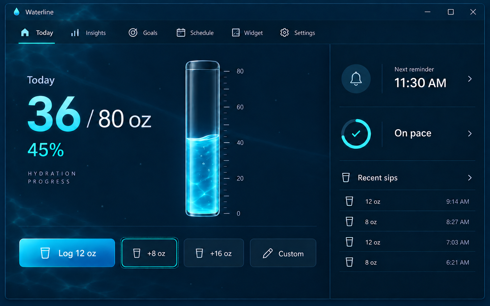
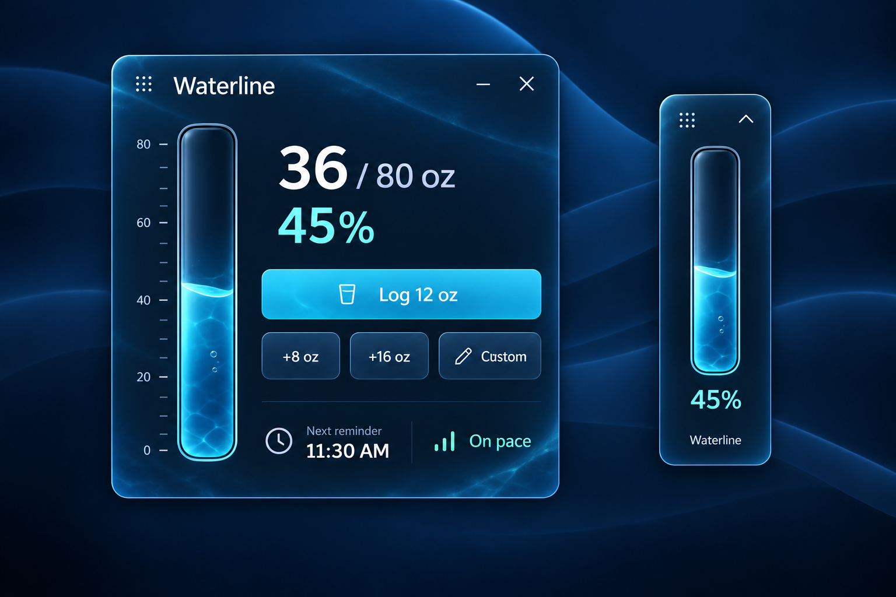

# Phase 1 — Direction D2: Living Water

Status: selected visual and motion direction

These generated images illustrate visual intent. The water and motion will be recreated with native WPF drawing and animation rather than embedded screenshots or video.

## Revision objective

Direction D established the correct structure but felt static. D2 retains that structure and makes water an active product material through a realistic reservoir surface and a slow atmospheric current behind the main dashboard.

## Reservoir water

The reservoir combines five controlled layers:

1. a clipped base fill tied exactly to hydration percentage;
2. a darker lower depth gradient;
3. an asymmetrical curved meniscus at the current fill level;
4. one slow moving caustic/refraction layer inside the water;
5. a very small number of rising microbubbles.

The water is more natural than a flat rectangle, but the vessel remains native UI geometry. It should not resemble a photographed glass tube or aquarium.

### Idle motion

- Two shallow surface waves move at different periods between 5 and 8 seconds.
- Normal wave amplitude remains between 1 and 2 effective pixels.
- The internal caustic layer drifts slowly over 14–20 seconds at low opacity.
- At most three microbubbles are visible in the dashboard reservoir and two in the compact widget.
- Bubble paths vary slightly and do not run in synchronized loops.

### Logging response

- Fill height moves to the new value over 500 ms with an ease-out curve.
- Surface-wave amplitude briefly rises to approximately 5 pixels, then settles over 900–1200 ms.
- Two or three bubbles may release from the lower edge after the fill changes.
- A soft cyan highlight passes upward once through the filled area.
- Numeric values cross-fade to the final amount without delaying state or input.

Undo uses the same behavior in reverse with a smaller surface response. The water level never overshoots the true value.

## Dashboard atmosphere

The main content canvas uses a deep navy depth field plus three lightweight layers:

- one broad current band moving horizontally over 24–32 seconds;
- sparse caustic geometry confined primarily to the upper-left and lower-left edges;
- a small set of slow drifting particles with varied paths and low opacity.

The activity rail remains darker and nearly static, helping it anchor the animated main region. Bright effects do not cross behind primary text or logging controls. The overall animated background contrast should remain below roughly 10% against its local surface.

The reference image captures one moment in the motion cycle. Production motion should be slower and subtler than a still image can communicate.

## Widget atmosphere

The expanded widget receives one large low-contrast current band and restrained edge caustics. Its text region stays quiet. The compact widget uses only:

- animated reservoir water;
- a faint edge-light sweep every 12–18 seconds;
- the existing small chevron affordance.

The compact surface remains minimal and does not gain decorative background particles, a large Expand button, or secondary status cards.

## Native implementation approach

The production reservoir should be a custom WPF `FrameworkElement` or templated control that draws clipped geometry from a dependency-property percentage. Wave points can be calculated by a small deterministic renderer and invalidated only while visible. The background uses reusable frozen geometries, gradient brushes, opacity masks, and transform animations.

Implementation limits:

- Cap custom water rendering at 30 frames per second unless profiling proves 60 is inexpensive.
- Stop rendering when a window is hidden or minimized.
- Freeze brushes and geometries that do not change.
- Avoid large live blur effects and full-window bitmap effects.
- Keep animation clocks shared rather than creating one timer per particle or bubble.
- Measure dashboard and widget CPU/GPU use independently on integrated graphics.

## Accessibility behavior

When Windows client-area animation is disabled or reduced motion is enabled:

- background currents, caustics, particles, bubbles, and edge sweeps stop;
- the reservoir retains its layered static depth and curved meniscus;
- progress changes immediately, followed by a brief opacity highlight;
- hydration percentage remains available through text and automation properties.

High-contrast mode removes decorative atmospheric layers and renders the reservoir using explicit system-compatible outlines and fill distinctions.

## Selection record

The owner approved this water realism and ambient-motion character. Exact implementation geometry, color tokens, accessibility alternatives, and performance thresholds are defined in the Phase 1 design system.
